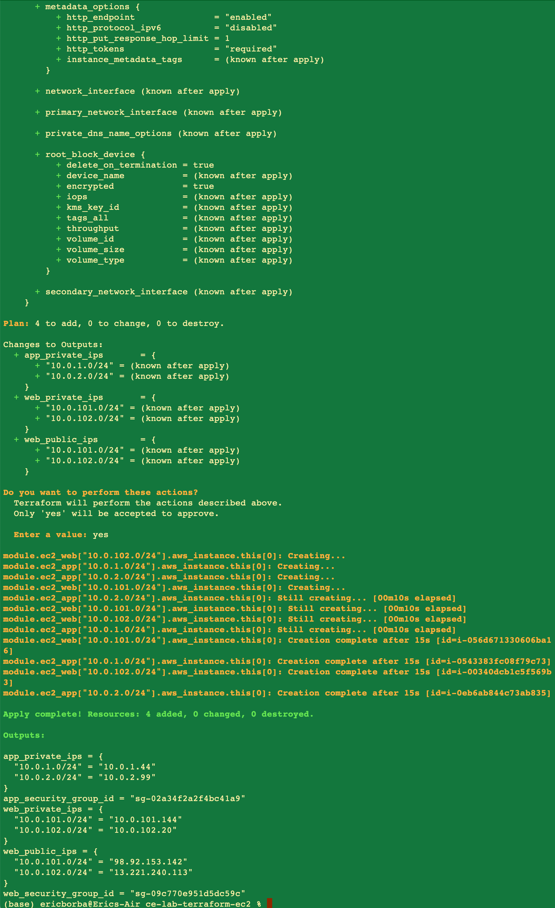
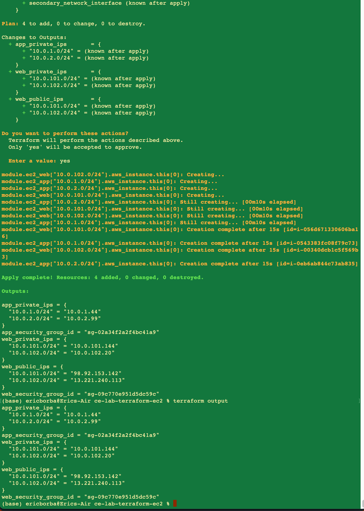
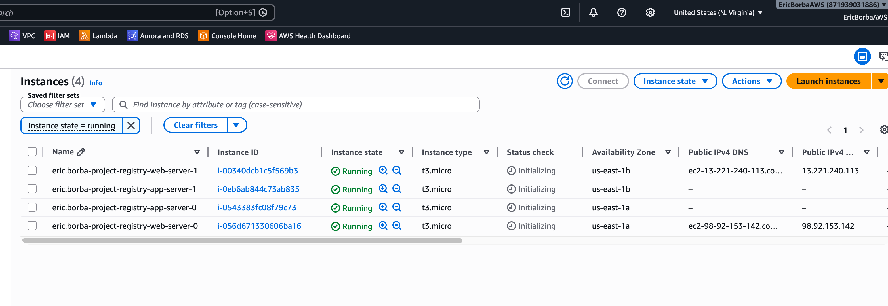
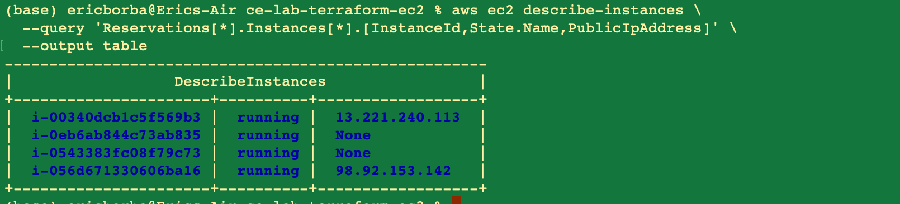
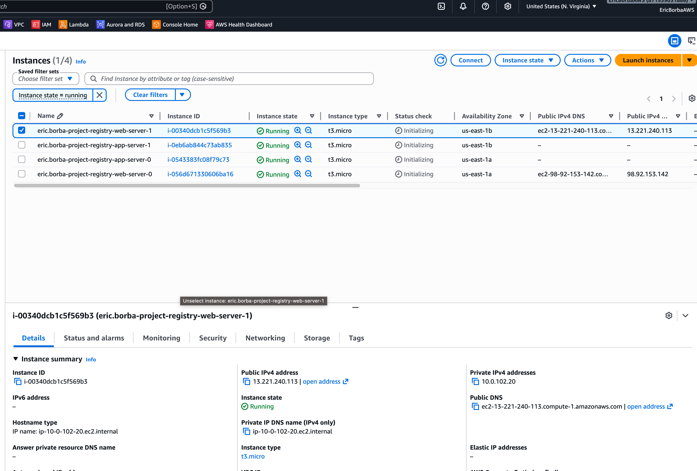
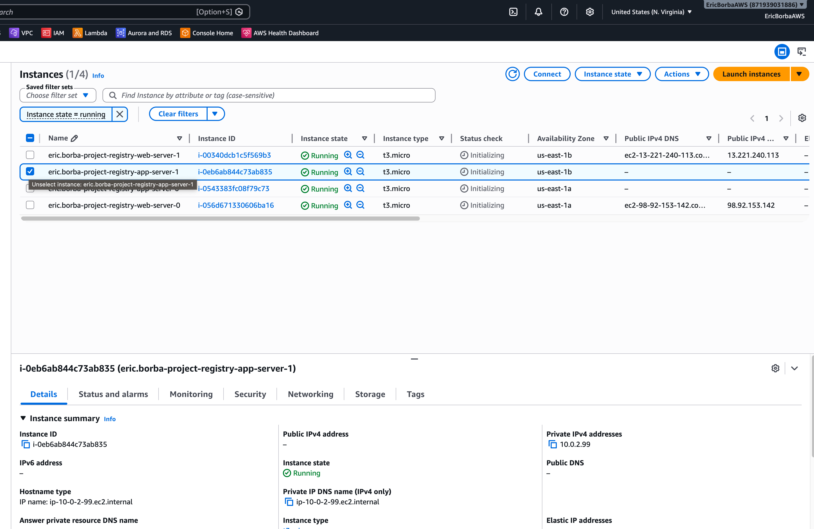
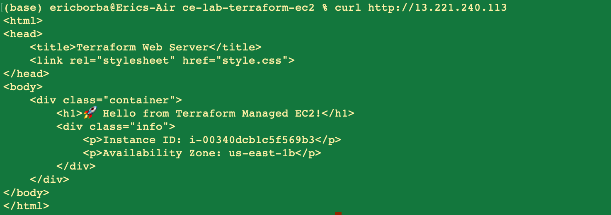
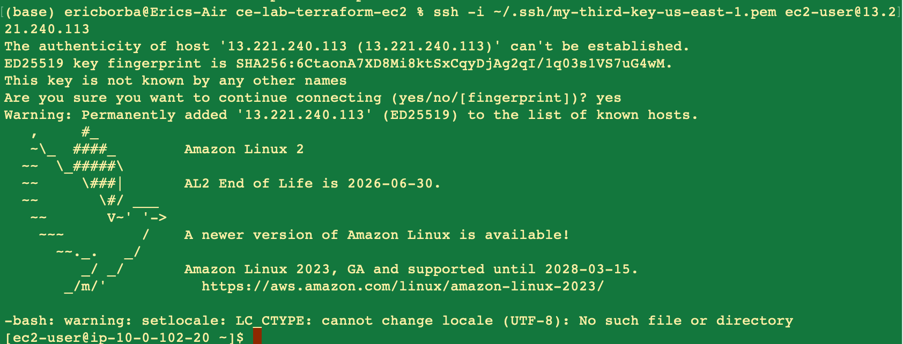

# Lab M4.08 - Deploy EC2 Infrastructure

**Course:** Cloud Engineering Bootcamp - Week 4  
**Estimated Time:** 60-75 minutes

## Objectives

- Deploy EC2 instances with Terraform
- Create security groups as code
- Use data sources for AMIs
- Implement user data
- Manage multiple instances

## Architecture

This lab deploys a two-tier EC2 infrastructure on AWS using Terraform modules:

```
Internet
    │
    ▼
[Web Security Group]  ← HTTP/HTTPS from 0.0.0.0/0, SSH from allowed CIDR
    │
[EC2 Web Servers]  ← 2x t3.micro in public subnets (us-east-1a, us-east-1b)
    │  (Apache + user data page showing instance ID and AZ)
    ▼
[App Security Group]  ← HTTP and SSH only from Web SG (bastion pattern)
    │
[EC2 App Servers]  ← 2x t3.micro in private subnets (us-east-1a, us-east-1b)
```

**VPC:** `10.0.0.0/16`  
**Public subnets:** `10.0.101.0/24`, `10.0.102.0/24`  
**Private subnets:** `10.0.1.0/24`, `10.0.2.0/24`

## Repository Structure

```
ce-lab-terraform-ec2/
├── main.tf               # VPC module + AMI data source
├── ec2-instances.tf      # Web and app EC2 modules
├── security-groups.tf    # Web and app security group modules
├── variables.tf          # Input variables
├── outputs.tf            # Public/private IPs and SG IDs
├── terraform.tfvars      # Variable values (key name, SSH CIDR)
├── user-data.sh          # Apache install + dynamic HTML page
├── README.md
└── screenshots/
```

## Key Design Decisions

- **AMI via data source** — `data "aws_ami"` always fetches the latest Amazon Linux 2, avoiding hardcoded AMI IDs that become stale across regions.
- **`for_each` with `zipmap`** — iterates over subnets using CIDR blocks (from variables) as static map keys, so Terraform can plan without needing unknown subnet IDs at plan time.
- **Web servers as bastion hosts** — the app security group only allows SSH from the web security group ID, so private instances are only reachable by jumping through a web server.
- **IMDSv2 enforced** — `metadata_options` sets `http_tokens = "required"` on all instances, preventing SSRF attacks against the metadata endpoint.
- **Encrypted gp3 volumes** — all root block devices use `encrypted = true` and `volume_type = "gp3"`.

## Prerequisites

- Terraform >= 1.6.0
- AWS CLI configured with credentials for `us-east-1`
- An EC2 key pair created in `us-east-1`

## Usage

```bash
terraform init
terraform plan
terraform apply
```

### Variables

| Variable | Description | Default |
|---|---|---|
| `key_name` | AWS EC2 key pair name | — |
| `ssh_cidr` | Allowed CIDR for SSH access | — |
| `instance_type` | EC2 instance type | `t3.micro` |
| `project_name` | Prefix for resource names/tags | `eric-borba-project` |
| `azs` | Availability zones | `["us-east-1a", "us-east-1b"]` |
| `public_subnets` | Public subnet CIDRs | `["10.0.101.0/24", "10.0.102.0/24"]` |
| `private_subnets` | Private subnet CIDRs | `["10.0.1.0/24", "10.0.2.0/24"]` |

## Screenshots

### Deploying the infrastructure


### Terraform output


### EC2 instances in AWS Console


### EC2 instances via CLI


### Checking public IP


### Checking private IP


### Curl to public IP (Apache response)


### SSH into instance


## Cleanup

```bash
terraform destroy
```

